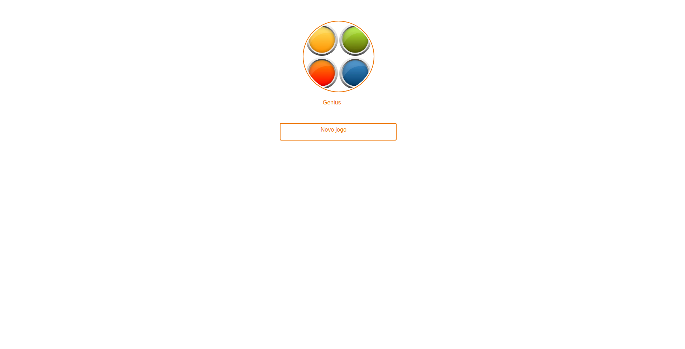
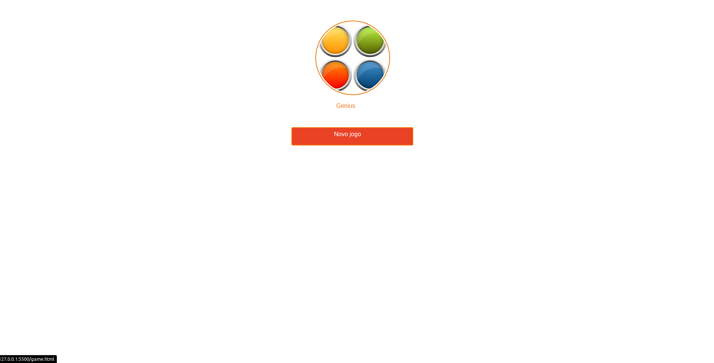
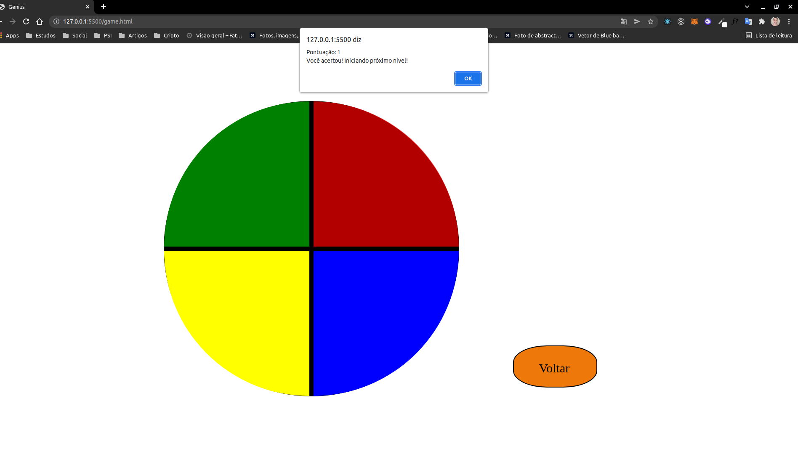

<H1 align="center"> </H1>

 

    
    

<a href="#sobre-o-projeto">Sobre o Projeto</a>&nbsp;&nbsp;|&nbsp;&nbsp;
<a href="#tecnologias">Tecnologias</a>&nbsp;&nbsp;|&nbsp;&nbsp;
<a href="#licença">Licença</a>

 

## Sobre o Genius
Genius é um jogo de memório cujo objetivo é desafiar os participantes a acertarem a sequencia de cores proposta pelo jogo.
  

  

  

 

## Tecnologias

- [HTML](https://www.w3schools.com/html/)
- [CSS](https://developer.mozilla.org/pt-BR/docs/Web/CSS)
- [Javascript](https://developer.mozilla.org/pt-BR/docs/Web/JavaScript)

 

## Licença
 

Esse projeto está sob a licença MIT. Veja o arquivo [LICENSE](/LICENSE) para mais detalhes.

 